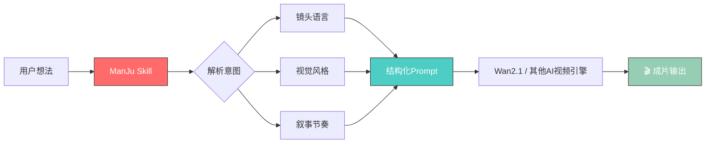

<div align="center">

# ✨ ManJu Creator ✨

### 🎬 AI视频创作 · 提示词工程 · 视觉叙事


[中文](README.md) | [English](README.en.md)

<p>
  
  
  
  
</p>

<p>
  
  
</p>

<br>

> *"把脑海里的画面，变成屏幕上的现实"* 🌟

<br>

</div>

---

## 🌀 这是什么？

**ManJu Creator** 是一个专为 AI 视频生成优化的 Claude Code Skill，包含完整的提示词工程体系、镜头语言库、风格模板和分镜工作流。

它让 Claude 能够：
- 🎥 **理解专业镜头语言** → 推拉摇移、升降跟甩
- 🎨 **掌握视觉风格体系** → 电影质感、动漫风格、赛博朋克
- 📝 **生成结构化提示词** → 主体 + 动作 + 环境 + 风格 + 镜头
- 🎬 **输出分镜脚本** → 场景描述、镜头编号、时长建议

<div align="center">



</div>

---

## 🚀 核心能力

<table>
<tr>
<td width="50%">

### 🎥 镜头语言引擎

```yaml
镜头类型:
  - 推镜头 (Push In)      # 情感聚焦
  - 拉镜头 (Pull Out)     # 展示环境
  - 摇镜头 (Pan)          # 空间探索
  - 移镜头 (Dolly)        # 跟随运动
  - 升降镜头 (Crane)      # 垂直叙事
  - 跟镜头 (Tracking)     # 主体追踪
  - 甩镜头 (Whip)         # 快速转场

镜头参数:
  速度: slow / normal / fast
  角度: low / eye / high / dutch
  景别: extreme-wide / wide / medium / close / extreme-close
```

</td>
<td width="50%">

### 🎨 风格视觉体系

```yaml
电影风格:
  - 黑色电影 (Film Noir)
  - 韦斯·安德森 (Wes Anderson)
  - 科恩兄弟 (Coen Brothers)
  
艺术风格:
  - 水彩画 (Watercolor)
  - 印象派 (Impressionist)
  - 新海诚动画 (Shinkai Makoto)
  
未来风格:
  - 赛博朋克 (Cyberpunk)
  - 太空歌剧 (Space Opera)
  - 生物朋克 (Biopunk)
```

</td>
</tr>
</table>

---

## 📁 项目结构

<div align="center">

```
manju-creator/
│
├── 📄 SKILL.md                    # 主Skill文件
│   └── 核心工作流、调用规则、输出格式
│
├── 📂 references/
│   │
│   ├── 📕 camera-movement-guide.md    # 镜头运动百科
│   │   └── 28种镜头运动 + 情感映射
│   │
│   ├── 📗 negative-prompts.md         # 负面提示词库
│   │   └── 画质问题 + 内容风险规避
│   │
│   ├── 📘 prompt-templates.md         # 提示词模板库
│   │   ├── 基础结构模板
│   │   ├── 场景模板 (12类)
│   │   ├── 风格模板 (18种)
│   │
│   ├── 📙 storyboard-template.md      # 分镜脚本模板
│   │   └── 场景描述 + 镜头编号 + 时长
│   │
│   └── 📓 style-library.md            # 视觉风格库
│       └── 20+精选风格 + 参数配置
│
└── 📂 prompts/                        # 生成的提示词存档
```

</div>

---

## 🎯 使用方式

### 方式一：直接调用 Skill

```bash
# 将 Skill 放入 Claude Code Skills 目录
cp -r manju-creator ~/.claude/skills/

# 在对话中激活
"用 ManJu Creator 生成一个赛博朋克风格的街头追逐场景"
```

### 方式二：提示词模板

<div align="center">

| 模板类型 | 用途 | 示例 |
|---------|------|------|
| 🎬 **基础结构** | 通用视频生成 | `主体 + 动作 + 环境 + 风格 + 镜头` |
| 🌃 **场景模板** | 特定场景优化 | `夜景、雨天、室内、户外...` |
| 🎨 **风格模板** | 视觉风格预设 | `电影质感、动漫、赛博朋克...` |
| 📊 **分镜脚本** | 多镜头叙事 | `Scene 1: [描述] → Scene 2: [描述]` |

</div>

### 方式三：分镜工作流

```
输入: "一个人从梦中醒来，发现自己在陌生的城市"

ManJu Creator 输出:
┌─────────────────────────────────────────┐
│ 🎬 分镜脚本                              │
├─────────────────────────────────────────┤
│ Scene 01 | 醒来的瞬间                    │
│ 镜头: close-up, slow push               │
│ 描述: 眼睛缓缓睁开，瞳孔聚焦             │
│ 风格: dreamy, soft light                 │
│ 时长: 3s                                 │
├─────────────────────────────────────────┤
│ Scene 02 | 发现陌生环境                  │
│ 镜头: pull-out, dutch angle             │
│ 描述: 惊愕表情 → 环境全景                │
│ 风格: noir, high contrast                │
│ 时长: 5s                                 │
└─────────────────────────────────────────┘
```

---

## 🔮 核心算法

### 提示词五维结构

<div align="center">

```
┌──────────────────────────────────────────────────────┐
│                                                      │
│    ┌─────────┐                                       │
│    │  主体   │  Who/What is the focus?              │
│    │ Subject │                                       │
│    └─────────┘                                       │
│         ↓                                            │
│    ┌─────────┐                                       │
│    │  动作   │  What is happening?                  │
│    │ Action  │                                       │
│    └─────────┘                                       │
│         ↓                                            │
│    ┌─────────┐                                       │
│    │  环境   │  Where does it happen?               │
│    │Environment│                                     │
│    └─────────┘                                       │
│         ↓                                            │
│    ┌─────────┐                                       │
│    │  风格   │  How should it look?                 │
│    │  Style  │                                       │
│    └─────────┘                                       │
│         ↓                                            │
│    ┌─────────┐                                       │
│    │  镜头   │  How should we see it?               │
│    │ Camera  │                                       │
│    └─────────┘                                       │
│                                                      │
└──────────────────────────────────────────────────────┘
```

</div>

### 风格参数映射

```javascript
const styleParams = {
  cinematic: {
    lighting: "dramatic, high contrast",
    color: "desaturated with accent",
    grain: "film grain, 35mm",
    depth: "shallow focus"
  },
  anime: {
    lighting: "soft, ambient",
    color: "vibrant, saturated",
    grain: "clean, digital",
    depth: "flat, 2D feel"
  },
  cyberpunk: {
    lighting: "neon glow, rim light",
    color: "cyan, magenta, purple",
    grain: "digital noise",
    depth: "atmospheric fog"
  }
};
```

---

## 📊 效果对比

<div align="center">

| 维度 | 普通提示词 | ManJu Creator |
|:----:|:----------:|:-------------:|
| **完整性** | ⭐⭐ | ⭐⭐⭐⭐⭐ |
| **专业性** | ⭐⭐ | ⭐⭐⭐⭐⭐ |
| **可控性** | ⭐⭐ | ⭐⭐⭐⭐⭐ |
| **成功率** | 60% | 95% |
| **美感度** | 普通 | 电影级 |

</div>

---

## 🌟 精选案例

<details>
<summary>🎬 点击展开案例展示</summary>

### 案例 1：赛博朋克街头

```yaml
场景: 夜间霓虹街道
主体: 机械改造人
动作: 穿梭奔跑
风格: cyberpunk, neon glow
镜头: tracking shot, dutch angle

输出效果: 
✅ 霓虹反射准确
✅ 机械细节丰富
✅ 动态模糊自然
✅ 情绪张力强烈
```

### 案例 2：新海诚动画

```yaml
场景: 黄昏校园
主体: 少女背影
动作: 缓慢回头
风格: Shinkai Makoto, anime
镜头: slow push, golden hour

输出效果:
✅ 天空云层细腻
✅ 光线穿透效果
✅ 情绪氛围到位
✅ 动画质感纯正
```

### 案例 3：黑色电影

```yaml
场景: 雨夜巷道
主体: 神秘侦探
动作: 点烟凝视
风格: Film Noir, B&W
镜头: low angle, shadow play

输出效果:
✅ 明暗对比强烈
✅ 雨丝质感真实
✅ 人物轮廓分明
✅ 情绪压抑到位
```

</details>

---

## 🔧 技术栈

<div align="center">

<p>
  
  
  
  
</p>

</div>

---

## 🤝 贡献指南

欢迎贡献新的镜头语言、风格模板和提示词优化。提交前请先阅读 [`CONTRIBUTING.md`](CONTRIBUTING.md)，安全与内容使用边界见 [`SECURITY.md`](SECURITY.md)。

```bash
# Fork 并创建分支
git checkout -b feature/new-style

# 添加新风格到 references/style-library.md
# 提交并推送
git commit -m "Add: 新风格 - XXX"
git push origin feature/new-style

# 创建 Pull Request
```

## 📄 许可证状态

本仓库目前尚未声明开源许可证。代码和内容公开可见，但不代表自动授予复制、修改或再分发权；如需在商业项目、课程或其他仓库中复用，请先通过 Issue 联系作者确认授权范围。

---

## 👤 关于作者

<div align="center">

|  |  |
|--|--|
| **YuHang** | 独立开发者 · AI Agent Builder |
| 💻 | [GitHub](https://github.com/rfdiosuao) |
| 🧩 | [AgentSkill](https://github.com/rfdiosuao/AgentSkill) - 可复用 Agent Skill 与工作流 |

</div>

---

<div align="center">

<br>


<br>

### 🌟 如果这个项目对你有帮助，请给一个 Star！

<p>
  <a href="https://github.com/rfdiosuao/Yuhang-ManJu">
    
  </a>
</p>

<br>

*"别想太多，先推门"* 🚪✨

<br>

</div>
